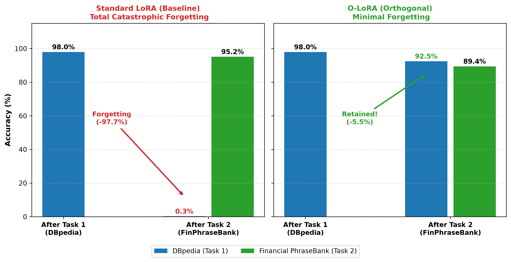

# O-LoRA: Orthogonal Low-Rank Adaptation for Continual Learning

This repository introduces new tests to evaluate O-LoRA against standard LoRA under a 2-task Continual Learning setup using **T-5 Large.**

We modify the paramater that enforces orthogonality ($\lambda_1$) from its default (0.5) to 0 to view whether O-LoRA's orthgonality helps mitigate catastraphic forgetting.

O-LoRA is a PEFT variety (of the LoRA family) designed to mitigate catastrophic forgetting for Large Language Models. Like LoRA, it creates an adapter that modifies a subset of the weights. However it aims to mitigate catastrophic forgetting by ading an orthogonal loss penality during gradient udpdates. This requires updates not to interfere with previous task's adaptations.

---

## Dataset Setup
The original O-LoRA paper contains 4 "orders" (sequences of different tasks). For this reproduction, we use a smaller order of our own consisting of two tasks: Topic Classification (TC) on DBpedia and Sentiment Classification (SC) on Financial Phrasebank.

---

## Results

We compare a standard LoRA baseline (setting the $\lambda_1$ to 0) against O-LoRA (with $\lambda_1 = 0.5$, O-LoRA's deafult setting). First we train on DBpedia and then evaluate DBpedia. Then we train on Financial Phrasebank and finally evaluate both Financial Phrasebank and DBpedia.omg 

| Method | DBpedia Initial | Financial PhraseBank Final | DBpedia Final | Forgetting |
| :--- | :---: | :---: | :---: | :---: |
| **Standard LoRA ($\lambda_1 = 0.0$)** | 97.97% | **95.15%** | **0.29%** | **-97.68%** |
| **O-LoRA ($\lambda_1 = 0.5$)** | 97.97% | **89.43%** | **92.47%** | **-5.50%** |

We observe:
1. Standard Lora suffers almost complete memory collapse on DBpedia.
2. O-Lora preserves accuracy on DBpedia, losing only 5.5% of task performance.
3. O-Lora does not reach the same levels of performance as standard LoRA, but only misses out on 5.7% to achieve near-total retention.

---

## Project Structure
Our modified files reside in:

`/scripts` contains our smaller custom orders, `order_minimal.sh` and `order_minimal_baseline.sh`.
`/hpc` contains the sbatch script to setup and run the orders on the university HPC cluter.
`logs_and_outputs` is in the .gitignore so the full result outputs have been moved her in `docs`, `all_results_o-lora.json` and `all_results_baseline.json`
Fincancial phrasebank data is added to `CL_Benchmark/SC`, following O-Lora's conventions.
`configs/` contains our custom config files for the Financial Phrasebank tasks, necessary to integrate O-LoRA with the rest of the project.